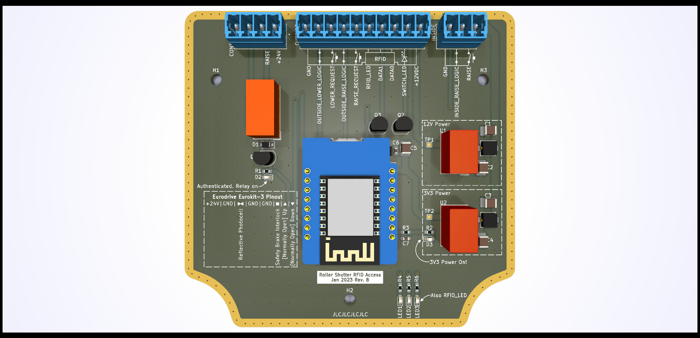
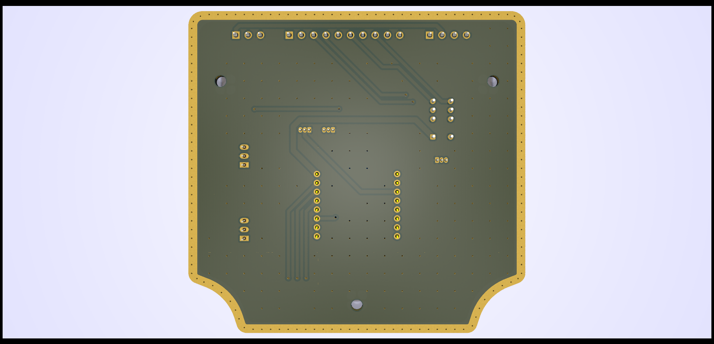
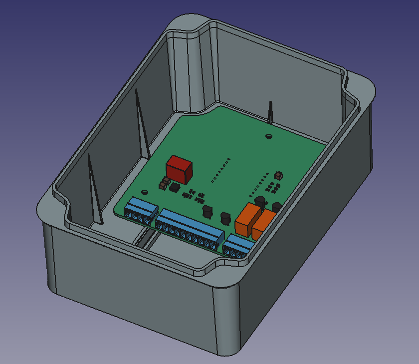

# Table of Contents

- [Introduction](https://github.com/swanseahackspace/roller-shutter-controller/#introduction)
- [Hardware](https://github.com/swanseahackspace/roller-shutter-controller/#hardware)
- [Software](https://github.com/swanseahackspace/roller-shutter-controller/#software)
	- [Requirements](https://github.com/swanseahackspace/roller-shutter-controller/#requirements)
	- [Installation](https://github.com/swanseahackspace/roller-shutter-controller/#installation)
  
# Introduction
Roller Shutter RFID Access Control PCB. Uses an ESP-32-C3 (Lolin C3 Mini)

# Hardware

#### Enclosure
The PCB has been designed to fit into ide EL161 enclosure.

- [Technical Drawing](hardware/enclosure-dimensions.pdf)
- [Product Page](https://ide.es/eng/products/junction-boxes-and-mechanisms/ip65-ip67-junction-boxes/ref_EL161)

#### KiCad Renders



#### Assembly Render


# Software
In the software folder you will find two programs:

- test is a simple script for doing hardware debugging. It provides a quick way to check that the LEDs are all working, and to toggle the relay on and off
- doorlock is a [submodule](https://git-scm.com/book/en/v2/Git-Tools-Submodules) of another git repo: https://github.com/swanseahackspace/doorlock. This is currently incompatable with this hardware, but will be modified to support both it's original hardware and the ESP-32-C3 via a flag in the config file.

### Requirements
- Arduino IDE or equivalent
- Arduino Libraries:
  - Adafruit Graphics
  - Adafruit SSD1306 Wemos Mini OLED

### Installation

1. Clone git repo
```
git clone https://github.com/swanseahackspace/roller-shutter-controller
```

2. Go into the doorlock directory
```
cd software/doorlock
```

3. Initialise the submodule
```
git submodule init
```

4. Update the submodule
```
git submodule update
```

5. Open .ino file in [Arduino IDE](https://www.arduino.cc/en/software)

6. Follow the [Wemos/Lolin C3 Mini Arduino development guide](https://www.wemos.cc/en/latest/tutorials/c3/get_started_with_arduino_c3.html)

7. Plug the board into your machine via the USB type-C port on the ESP-32-C3

8. Check the correct port is set in the Arduino IDE (Tools -> Port)

9. Upload the code to the ESP32

### Troubleshooting

*Errors uploading code to ESP-32-C3*
Use the following procedure:

- Hold on Button 9
- Press Button Reset
- Release Button 9 When you hear the prompt tone on usb reconnection
